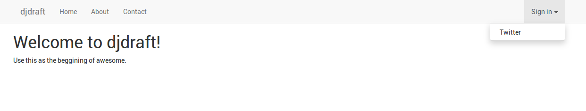
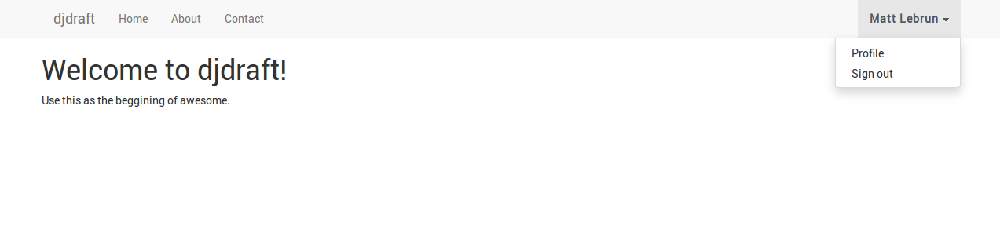

Django DRAFT
============

The (D)jango (R)ESTFramework (A)pp(F)u (T)emplate

An opinionated Django starter template with sane defaults and saves you time.

- Uses the latest (or tries) package versions
- Made a lot of assumptions
- Runs on Docker
- Has settings for `prod` and `dev` environments
- Uses Bootstrap+Material design for starter template
- PostgreSQL for Database
- Configured Celery with RabbitMQ as broker
- Memcached for prod cache
- Redis container linked
- Nginx with SSL configuration included
- Sphinx doc configuration included
- Perfect for both hobby and production projects


## Requirements

- Linux
- Python 3.x
- Django 1.11.x
- Docker
- Docker Compose


**Tested on:**

- Ubuntu 16.04
- Docker 17.06.2-ce
- Docker Compose 1.15.0


## Usage

If you named your app `{{ project_name }}` and your using the master branch:

```
$ django-admin startproject --template=https://github.com/cr8ivecodesmith/djdraft/archive/master.zip --extension=py,md,yml,env,sample,conf,json --name Dockerfile {{ project_name }}
```

## Development Quickstart

Build the app image

```
$ docker-compose -f compose/dev.yml -p {{ project_name }} build {{ project_name }}_app
```

Add `{{ project_name }}.dev` to your `/etc/hosts` file:

```
$ echo "0.0.0.0		{{ project_name }}.dev" | sudo tee -a /etc/hosts
```

Generate dev ssl keys:

```
$ . var/etc/ssl/generate_ssl.sh var/etc/ssl {{ project_name }}.dev
```

Run compose:

```
$ docker-compose -f compose/dev.yml -p {{ project_name }} run --service-ports nginx
```

Open your browser to:

```
https://{{ project_name }}.dev:8022
```


## Screenshots






## TODO

- Add default assets and templates
- Test production settings
- Document assumptions made
- Document customization options
- Update screenshots
