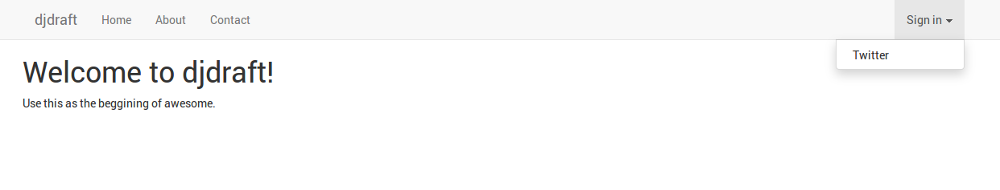
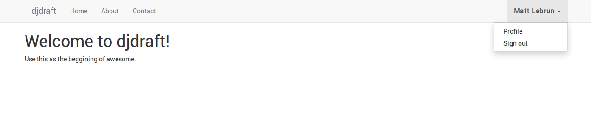

Django DRAFT
============

The (D)jango (R)ESTFramework (A)pp(F)u (T)emplate

An opinionated Django starter template with sane defaults and saves you time.

- Uses the latest (or tries) package versions
- Made a lot of assumptions
- Runs on Docker
- Has settings for `prod` and `dev` environments
- Uses Bootstrap+Material design for starter template
- PostgreSQL for Database
- Configured Celery with RabbitMQ as broker
- Redis and Nginx configuration included
- Perfect for both hobby and production projects


## Requirements

- Django 1.8+ (to pull the template)
- Docker
- Docker Compose


## Issues

Currently `django-celery` is broken on v1.10.x so this branch is going to
stuck on 1.9.x until they've officially fixed it.

To follow the issue:
https://github.com/celery/django-celery/pull/468


## Usage

If you named your app `{{ project_name }}` and your using the master branch:

```
django-admin startproject --template=https://github.com/cr8ivecodesmith/djdraft/archive/master.zip --extension=py,md,yml,env,sample,conf,json --name Dockerfile,DockerfileNginx {{ project_name }}
```

## Quickstart

Copy or rename the `vars.env.sample` file:

```
cp vars.env.sample vars.env
```

Copy the `keys.json.sample` file and change the values accordingly:

```
cp app/settings/keys.json.sample app/settings/keys.json
```

Add {{ project_name }}.dev to you /etc/hosts file:

```
echo "0.0.0.0       {{ project_name }}.dev" | sudo tee -a /etc/hosts
```

Generate dev ssl keys:

```
source scripts/generate_ssl.sh var/ssl {{ project_name }}.dev
```

Run compose:

```
docker-compose -f compose/dev.yml run --service-ports nginx
```

Then you should be able to ssh to the web container:

```
ssh happy@0.0.0.0 -p 2767
```

Open your browser to:

```
https://{{ project_name }}.dev:8017
```


## Screenshots






## TODO

- Add default assets and templates
- Test production settings
- Document assumptions made
- Document customization options
- Update screenshots
